# Data Battle 2026 - Meteorage
## Prediction probabiliste de la fin d'un orage

> **Application de demonstration** : [databattle-ai-2026.streamlit.app](https://databattle-ai-2026.streamlit.app)

---

## Equipe — Pied Piper Jr.

| Nom |
|-----|
| HASSANA Mohamadou |
| KENGALI Pacome |
| KOMGUEM Helcias |
| MAFFO Natacha |
| MBASSI Loic |
| MOGOU Igor |

---

## Problematique

Les aeroports maintiennent une alerte orageuse pendant une duree fixe de 30 a 60 minutes apres le dernier eclair detecte. Cette approche conservative engendre des immobilisations couteuses : plusieurs centaines d'heures d'exploitation perdues chaque annee.

**Question centrale** : peut-on anticiper la fin reelle d'un orage pour lever l'alerte plus tot, tout en garantissant la securite (risque < 2%) ?

---

## Solution proposee

Un modele probabiliste qui estime, pour chaque eclair nuage-sol (CG), la probabilite qu'il soit le dernier de l'alerte. Lorsque le score de confiance depasse un seuil theta, l'alerte est levee de facon anticipee.

**Resultat principal** : **548.3 heures de gain** operationnel sur 1081 alertes (eval 2023-2025), soit environ **30 minutes recuperees par alerte**, avec un risque de **1.76%** (contrainte < 2% respectee).

### Pipeline global

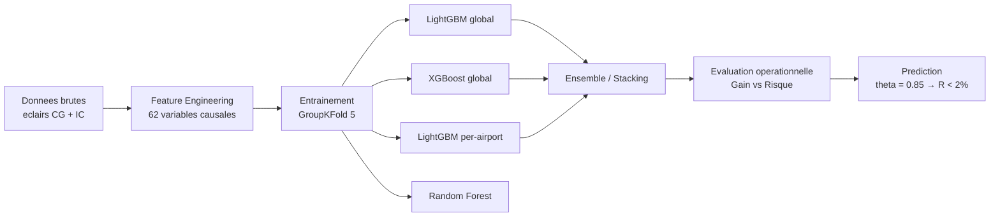

### Flux de prediction

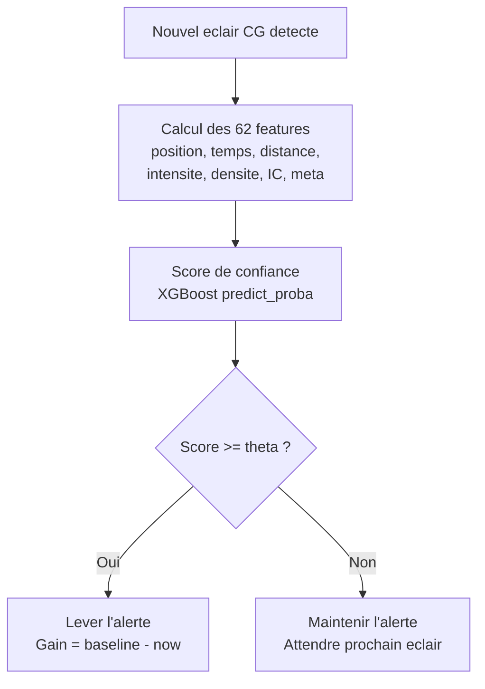

---

## Donnees

- **Source** : Meteorage (reseau de detection de foudre europeen)
- **Entrainement** : 2016-2022, 507 071 eclairs, 769 alertes
- **Evaluation** : 2023-2025, 188 175 eclairs, 1081 alertes
- **Aeroports** : Ajaccio, Bastia, Biarritz, Nantes, Pise
- **Rayon** : 30 km autour de chaque aeroport
- **Types d'eclairs** : CG (nuage-sol, cible) et IC (intra-nuage, contexte)
- **Desequilibre** : 4.64% de positifs (dernier CG), ratio 1:20

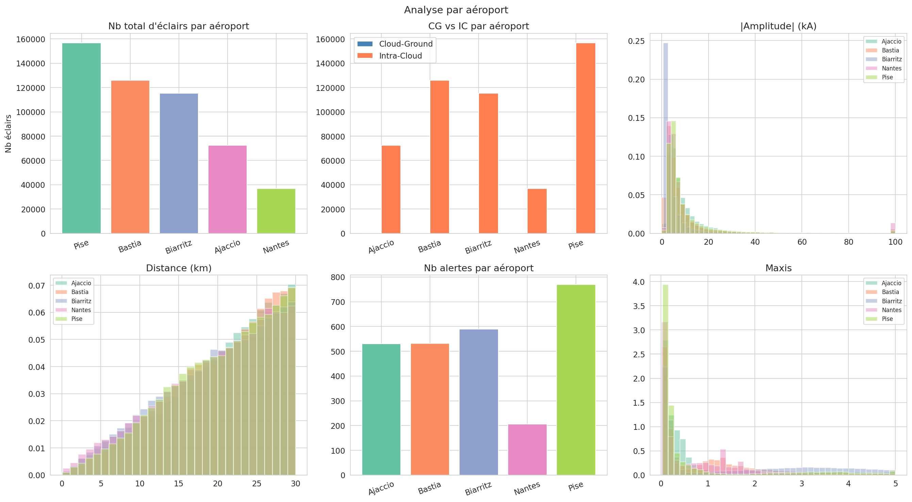

*Repartition des eclairs CG et IC, nombre d'alertes et distribution des distances pour les 5 aeroports.*

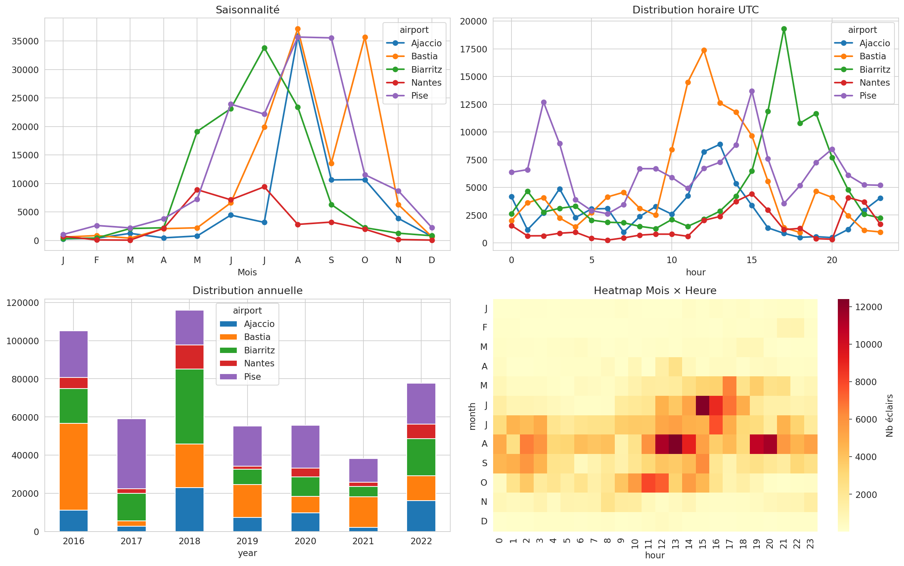

*Activite orageuse concentree en ete (juin-septembre) avec pic convectif entre 14h et 18h UTC.*

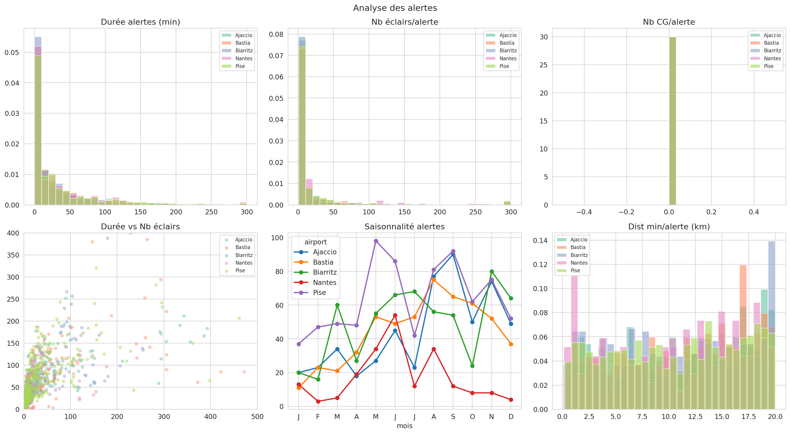

*Duree mediane d'une alerte : 18 minutes. Nombre median d'eclairs CG : 15.*

---

## Feature Engineering

Toutes les features sont calculees strictement a partir des informations disponibles au moment t (pas de data leakage). Variables futures exclues : `total_in_alert`, `rel_pos`, `remaining`.

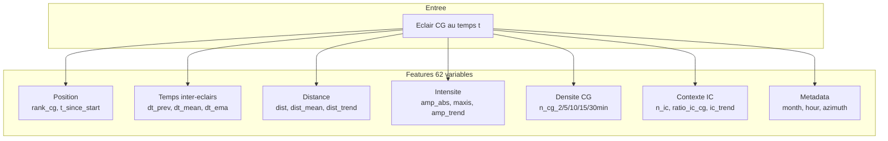

| Categorie | Variables | Signal capte |
|---|---|---|
| Position | `rank_cg`, `t_since_start_s` | Probabilite croissante de fin |
| Temps inter-eclairs | `dt_prev_s`, `dt_mean_W`, `dt_ema_W` | Espacement croissant = fin proche |
| Distance | `dist`, `dist_mean_W`, `dist_trend_W` | Orage qui s'eloigne |
| Intensite | `amp_abs`, `maxis`, `amp_trend_W` | Declin energetique |
| Densite CG | `n_cg_2/5/10/15/30min` | Ralentissement de l'activite |
| Contexte IC | `n_ic`, `ratio_ic_cg`, `ic_trend` | Precurseur de la fin |
| Metadata | `month`, `hour`, `azimuth` | Saisonnalite, trajectoire |

### Signaux discriminants

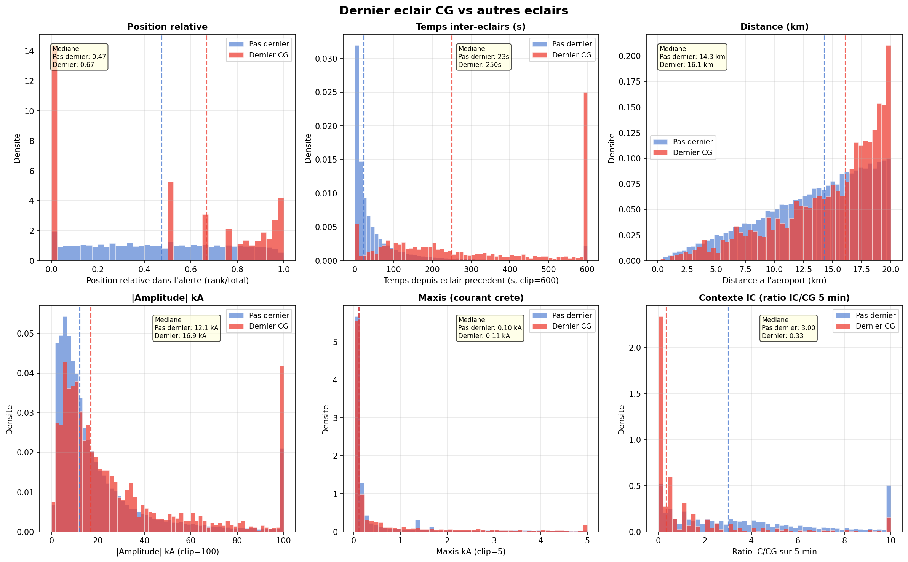

*Le dernier eclair CG presente un espacement temporel +167% superieur, une distance +13% plus grande et une densite d'activite -81% par rapport aux eclairs precedents.*

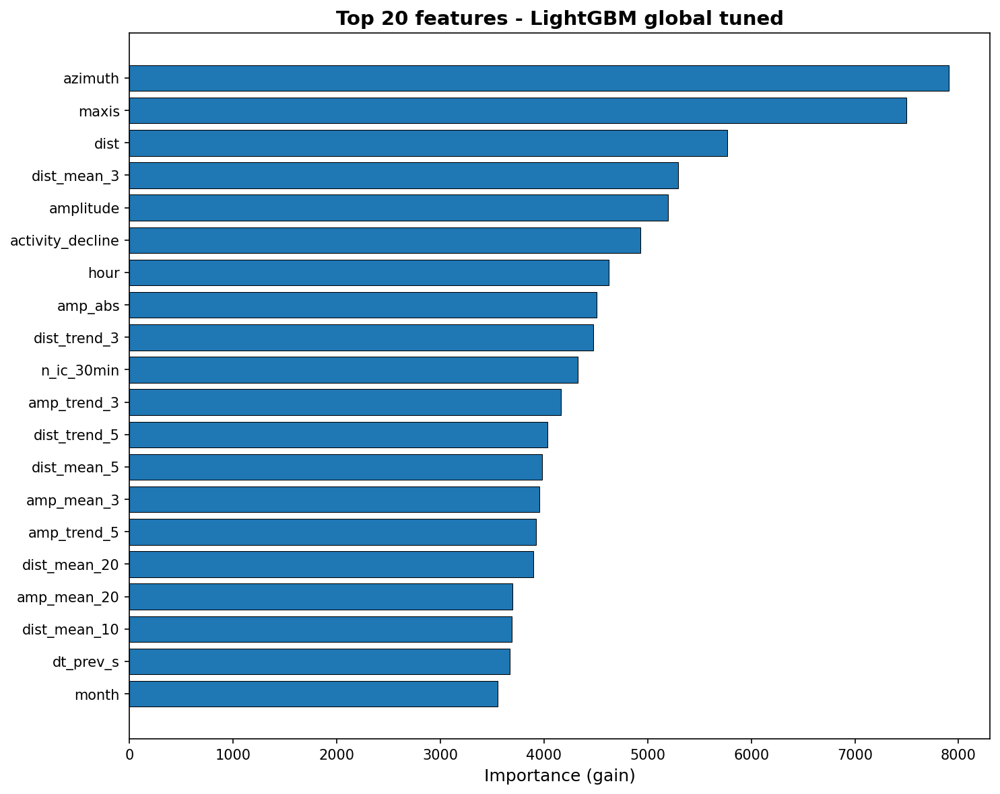

*Top 20 features par importance (gain LightGBM). L'azimuth (trajectoire), le maxis (energie) et la distance dominent.*

---

## Comparaison des modeles

Le desequilibre de classes (4.64% positifs) rend l'accuracy inadaptee. Nous utilisons le **F1**, l'**AUC-PR** (Average Precision) et le **MCC** (Matthews Correlation Coefficient).

### Choix et justification des modeles

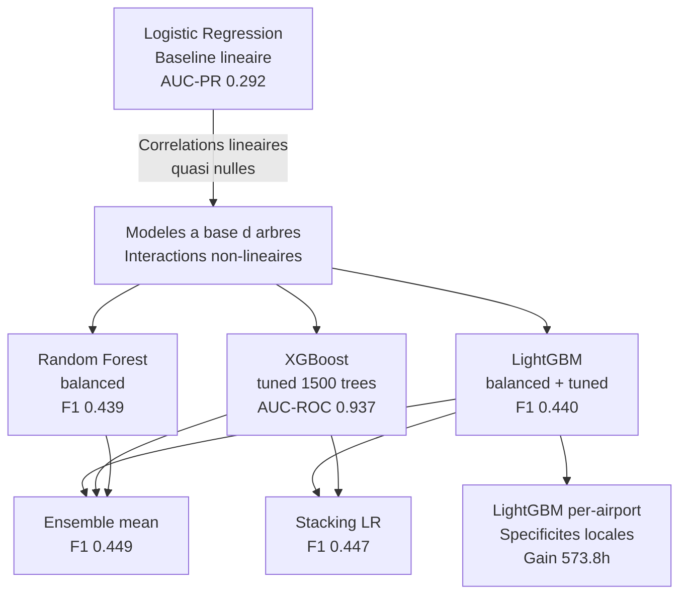

La **Logistic Regression** sert de baseline : son AUC-PR de 0.292 confirme que les correlations lineaires avec la cible sont quasi nulles (visible sur la matrice de correlation). Les modeles a base d'arbres capturent les interactions non-lineaires essentielles.

**XGBoost et LightGBM** sont proches mais XGBoost tuned obtient le meilleur AUC-ROC (0.937) et AUC-PR (0.419). Son `scale_pos_weight` proportionnel au ratio d'imbalance se comporte aussi bien que le `class_weight='balanced'` de LightGBM.

L'**ensemble** ameliore le F1 (0.449) en combinant la diversite des modeles, mais pour l'evaluation operationnelle le **XGBoost seul** domine grace a une meilleure calibration des probabilites.

Les **modeles per-airport** capturent les specificites locales (orages mediterraneens courts vs atlantiques variables) et donnent le meilleur gain brut (573.8h).

### Resultats de classification (OOF GroupKFold 5, train 2016-2022)

| Modele | AUC-ROC | AUC-PR | F1 | Precision | Rappel | MCC |
|---|---|---|---|---|---|---|
| Ensemble (LGB + XGB + per-airport) | 0.9354 | 0.4161 | **0.4489** | 0.379 | 0.550 | 0.425 |
| XGBoost tuned (1500 trees) | **0.9365** | **0.4190** | 0.4478 | 0.350 | **0.622** | **0.433** |
| Stacking (LR sur 5 modeles) | 0.9352 | 0.4157 | 0.4469 | 0.365 | 0.576 | 0.426 |
| LightGBM tuned (2000 trees) | 0.9338 | 0.4091 | 0.4398 | 0.355 | 0.577 | 0.419 |
| Random Forest balanced | 0.9345 | 0.4049 | 0.4392 | 0.360 | 0.564 | 0.417 |
| Logistic Regression balanced | 0.9170 | 0.2919 | 0.3888 | 0.298 | 0.558 | 0.369 |

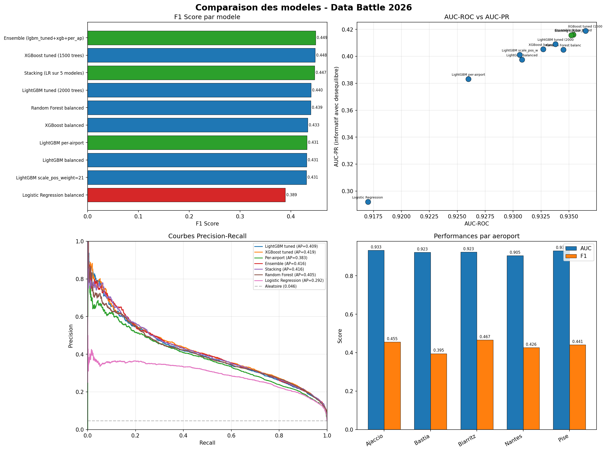

*F1 par modele, AUC-ROC vs AUC-PR, courbes PR, et performances par aeroport.*

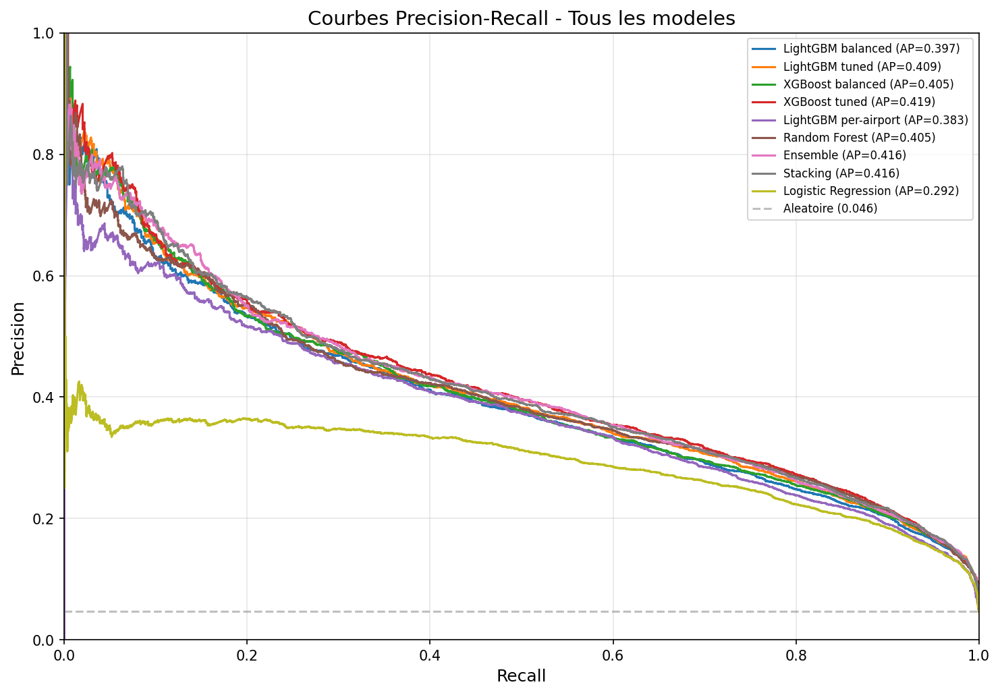

*Courbes Precision-Recall. L'AUC-PR est la metrique de reference en cas de desequilibre.*

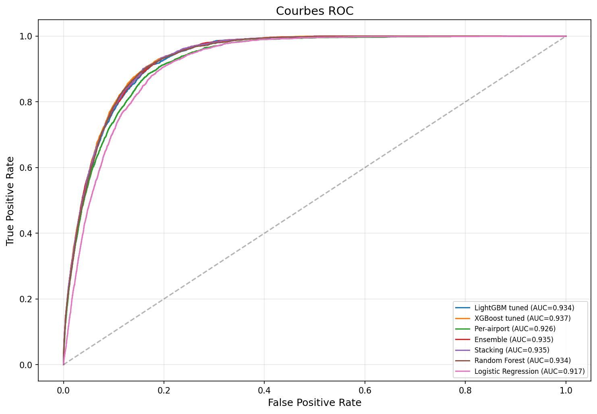

*Tous les modeles a base d'arbres depassent AUC=0.92.*

---

## Evaluation operationnelle

### Protocole Meteorage

- **Gain** = somme de (baseline_end - predicted_end) sur toutes les alertes (baseline = dernier eclair + 30 min)
- **Risque** = proportion d'eclairs < 3 km survenant apres la fin predite
- **Contrainte** : Risque < 2%
- **Theta** = seuil de confiance : le premier eclair dont le score depasse theta declenche la levee d'alerte

### Resultats (eval 2023-2025, 1081 alertes)

| Modele | Theta | Gain (heures) | Risque | Gain par alerte |
|---|---|---|---|---|
| Baseline (30 min fixe) | - | 0 | 0.00% | 0 min |
| LightGBM global tuned | 0.90 | 278.5 | 1.90% | 15.5 min |
| Ensemble | 0.80 | 404.0 | 1.79% | 22.4 min |
| LightGBM per-airport | 0.60 | 573.8 | 1.88% | 31.8 min |
| **XGBoost global tuned** | **0.85** | **548.3** | **1.76%** | **30.4 min** |

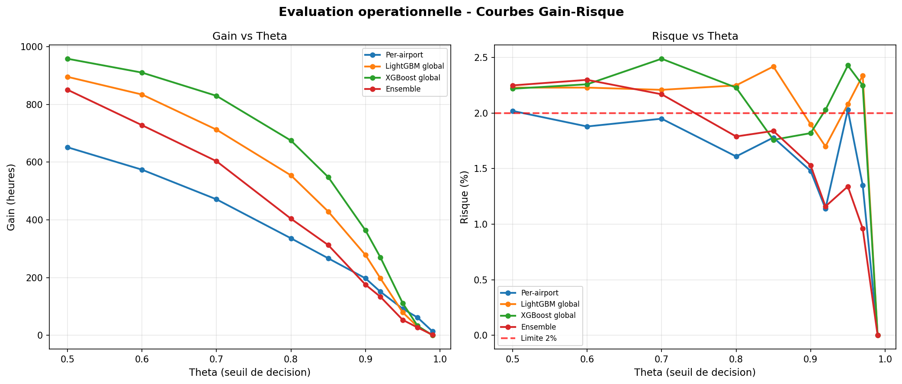

*Gain et risque en fonction du seuil theta. Le XGBoost offre le meilleur gain sous la contrainte R < 2%.*

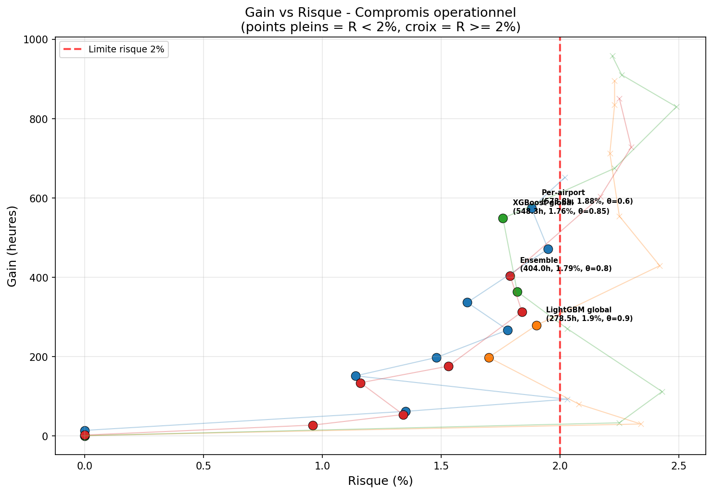

*Compromis Gain/Risque : points pleins = R < 2% (zone valide), croix = R >= 2%.*

### Performances par aeroport

| Aeroport | AUC | F1 | Seuil optimal | Profil meteorologique |
|---|---|---|---|---|
| Ajaccio | 0.933 | 0.455 | 0.248 | Convection mediterraneenne intense et courte |
| Bastia | 0.923 | 0.395 | 0.282 | Orages mediterraneens, variabilite moderee |
| Biarritz | 0.924 | 0.467 | 0.132 | Orages atlantiques, trajectoires O-E variables |
| Nantes | 0.905 | 0.426 | 0.079 | Orages continentaux, peu d'alertes |
| Pise | 0.931 | 0.441 | 0.422 | Orages liguriens, fort ratio IC/CG |

---

## Stack technique

| Composant | Technologie |
|---|---|
| Langage | Python 3.10 |
| ML | LightGBM, XGBoost, scikit-learn |
| Visualisation | Plotly, Matplotlib, Seaborn |
| Application | Streamlit |
| Validation | GroupKFold (5 folds par alerte) |
| Donnees | Pandas, NumPy |

---

## Installation et execution

### Pre-requis

```bash
pip install -r requirements.txt
```

### Lancer l'application Streamlit

```bash
cd Data_Battle_2026
streamlit run app.py
```

### Evaluer avec le protocole officiel

```bash
# Ouvrir dans Jupyter :
dataset_test/Evaluation_databattle_meteorage.ipynb
# Charger : predictions.csv
```

### Reproduire l'entrainement

```bash
python model_comparison.py   # compare 10 configurations de modeles
```

---

## Utilisation de l'application

L'application propose trois pages accessibles depuis la barre laterale.

### Page 1 — Prediction en temps reel

1. Choisir un dataset (Evaluation 2023-2025 ou Entrainement 2016-2022)
2. Selectionner un aeroport et un numero d'alerte
3. Ajuster le seuil **theta** dans la barre laterale (0.85 recommande pour R < 2%)
4. Lire le graphique : la courbe bleue monte quand le modele detecte la fin de l'orage

Le graphique affiche sur 3 panneaux : le score de confiance avec la ligne theta et les dates predite/reelle, la distance a l'aeroport (ligne rouge = 3 km), et l'activite CG sur les 5 dernieres minutes.

### Page 2 — Analyse exploratoire

Affiche les 20 figures generees lors de l'EDA : distribution par aeroport, saisonnalite, structure des alertes, azimuth, signaux discriminants, importance des features, courbes operationnelles.

### Page 3 — Guide d'utilisation

Contient le tableau des seuils par aeroport, l'interpretation du score, et le pipeline technique complet.

### Format CSV attendu

| Colonne | Type | Description |
|---|---|---|
| date | timestamp UTC | Date et heure de l'eclair |
| airport | texte | Nom de l'aeroport |
| airport_alert_id | entier | Identifiant de l'alerte |
| dist | km | Distance a l'aeroport |
| azimuth | degres | Direction 0-360 |
| amplitude | kA | Intensite du courant |
| maxis | kA | Courant crete |
| icloud | booleen | True = IC, False = CG |

---

## Structure du projet

```
Data_Battle_2026/
|-- app.py                              # Application Streamlit
|-- 01_EDA_exploration.ipynb            # Notebook EDA
|-- 02_model_prediction.ipynb           # Notebook modelisation (18 figures)
|-- model_comparison.py                 # Script comparaison multi-modeles
|-- predictions.csv                     # Predictions eval (format officiel)
|-- requirements.txt                    # Dependances Python
|-- models/
|   |-- xgb_tuned.pkl                   # XGBoost global (meilleur operationnel)
|   |-- lgbm_per_airport.pkl            # LightGBM par aeroport
|   |-- lgbm_v3.pkl                     # LightGBM global (fallback)
|-- plots/                              # 20 figures EDA et evaluation
|-- segment_alerts_all_airports_train/  # Donnees entrainement
|-- segment_alerts_all_airports_eval.csv # Donnees evaluation
|-- dataset_test/                       # Notebook evaluation officiel
```

---

## Charger un modele en Python

```python
import pickle

# XGBoost global (meilleur operationnel, theta=0.85)
with open('models/xgb_tuned.pkl', 'rb') as f:
    xgb_pack = pickle.load(f)

proba = xgb_pack['model'].predict_proba(X[xgb_pack['features']])[:, 1]
y_pred = (proba >= 0.85).astype(int)  # lever l'alerte si score >= theta

# LightGBM par aeroport (meilleur gain brut, theta=0.60)
with open('models/lgbm_per_airport.pkl', 'rb') as f:
    ap_pack = pickle.load(f)

airport = 'Ajaccio'
model = ap_pack['airport_models'][airport]['model']
proba = model.predict_proba(X[ap_pack['features']])[:, 1]
```

### Format des predictions (predictions.csv)

| Colonne | Description |
|---|---|
| airport | Nom de l'aeroport |
| airport_alert_id | Identifiant de l'alerte |
| prediction_date | Date de l'eclair evalue |
| predicted_date_end_alert | Date predite de fin d'alerte |
| confidence | Score de confiance [0, 1] |
